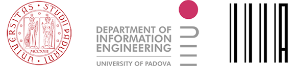

# DocTAG: A Customizable Annotation Tool for Ground Truth Creation


This repository contains the full source code of DocTAG, a portable and customizable annotation tool specifically designed for the Information Retrieval (IR) domain.

DocTAG provides four annotation types:

* *Labels*: allows the user to assign, by clicking on a radio button, one  label for each document (e.g. "*Relevant*" to indicate that a document is relevant for a certain topic) . 
* *Passages*: allows the user to identify and annotate the passages of a document with user-specified labels, highlighted in different colors.
* *Linking*: allows the user to link the passages identified with the corresponding user-defined concepts. Users can link the same passage to multiple concepts.
* *Concepts*: allows the user to specify the relevant concepts for a document. Users can take advantage of auto-complete facilities for searching the relevant concepts to assign to each document.

## Functionalities

DocTAG provides the following functionalities:

- a web-based collaborative annotation platform, enabling users to consult the annotations made by other team users and to transfer the annotations between annotators. Moreover, users can edit the annotations transfered from other annotators in their own profiles.
- Long passage annotation facilities (i.e. users can click on the first and the last passage word to get all the words in-between selected)
- support for passage highlighting in different colors
- automatic saving every time an action is performed
- sorting of documents according to two different strategies: lexicographic order
  and “unannotated-first” policy
- web responsive design to support mobile devices
- download of annotations and ground truths in several formats (e.g., CSV and JSON)
  

- support for passage-level annotation (i.e. users can assign a user-specified label to a particular passage)
- support for document-level annotation (i.e. users can assign a label and/or a set of concepts to describe a particular document)
- multilingual support (i.e. documents are grouped by language)
- support for custom user-defined concepts for the concept annotation task. Concepts defined in existing ontology are supported as well.
- import of document corpus, runs and topics in different formats (e.g. CSV and JSON) 
- support for annotation of PubMed articles
- support for visualization of document's annotations
  

- support for inter-annotator agreement
  

- support for the upload and visualization of other team members' ground-truths
  

## Files

The directory tree is organized as follows:

- The *DocTAG_Dockerized* directory contains the full source code of DocTAG.
- The *example* directory contains some instances of CSV/JSON files to work with.
- The *images* directory contains the project images such as the screeenshots of DocTAG. 

 

# Requirements

Since DocTAG is provided as a Docker container, both [docker](https://docs.docker.com/engine/reference/commandline/docker/) and [docker-compose](https://docs.docker.com/compose/) are required. To this aim, check out the [installation procedure](https://docs.docker.com/get-docker/) for your platform. Moreover, the DocTAG docker container instantiates a [PostgreSQL](https://www.postgresql.org/) database, so if you plan to insert a large amount of data make sure you have enough disk space. For what concerns the browser choice, Chrome would be the best browser to work with DocTAG. Nevertheless, both Safari and Firefox are supported as well.


# Installation
If you already have both [docker](https://docs.docker.com/engine/reference/commandline/docker/) and [docker-compose](https://docs.docker.com/compose/) installed on your machine, you can skip the first two steps.

1. Install Docker. To this aim, check out the correct [installation procedure](https://docs.docker.com/get-docker/) for your platform.

2. Install Docker-compose. As in the first step, check out the correct [installation procedure](https://docs.docker.com/compose/install/) to get [docker-compose](https://docs.docker.com/compose/) installed for your platform.

3. Check the Docker daemon (`dockerd`)  is up and running.

4. Download or clone the [doctag-core](https://github.com/DocTAG/doctag-core) repository.

5. Open the [DocTAG_Dockerized](https://github.com/DocTAG/doctag-core/tree/main/DocTAG_Dockerized) project folder and, on a new terminal session, type ```docker-compose up```. After running the latter command the installation of DocTAG dependencies is performed and the following output will be generated:

   

   **NOTE**: In Unix-like systems `docker-compose` should be run  without using `sudo` in a directory owned by the user.

6. DocTAG installation has completed and you can access it on your browser at http://0.0.0.0:8000/.

**NOTE**: If you want to shut down DocTAG, open a new terminal window and navigate to the project folder. Finally type `docker-compose down`

**NOTE**: If you want to redo the whole installation process and run DocTAG in *Test Mode* (i.e., with the provided sample data) open a new terminal and, inside the project folder, run the following commands: 

   1. `docker-compose down`
   2. `sudo rm -rf data`
   3. `docker image ls`
   4. Then select the IMAGE ID of the image whose name is *doctag dockerized web* and run: `docker image rm <IMAGE ID>`
   5. Finally run `docker-compose up`


# Getting started


## Customize MedTAG


# Credits

DocTAG has been developed by the [Intelligent Interactive Information Access Hub (IIIA)](http://iiia.dei.unipd.it/) of the  [Department of Information Engineering](https://www.dei.unipd.it/en/), [University of Padua](https://www.unipd.it/en/), Italy.



## Acknowledgements 


This work was partially supported by [ExaMode](https://www.examode.eu/), European Union Horizon 2020 program under Grant Agreement no. 825292.

## Contacts

Any questions? The authors are glad to answer your questions and receive your feedback or suggestions to further improve DocTAG. 

- [Fabio Giachelle](http://www.dei.unipd.it/~giachell) · fabio.giachelle AT unipd.it
- [Ornella Irrera](http://www.dei.unipd.it/~irreraorne) · ornella.irrera AT unipd.it
- [Gianmaria Silvello](http://www.dei.unipd.it/~silvello/) · gianmaria.silvello AT unipd.it
