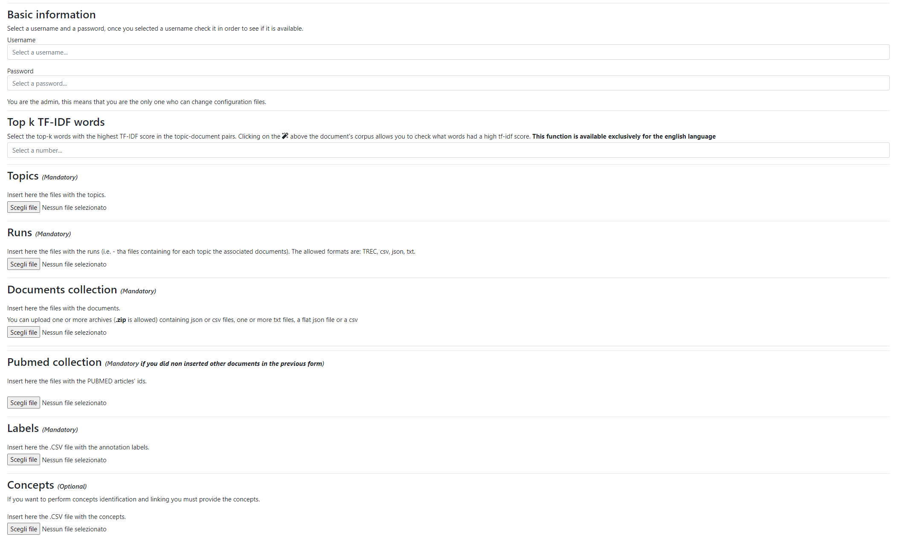
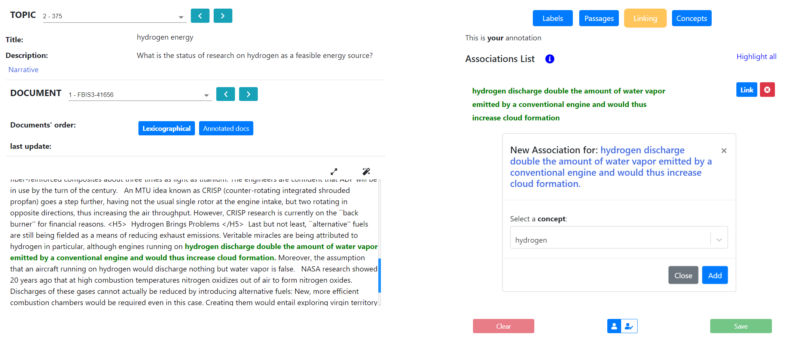

# DocTAG: A Customizable Annotation Tool for Ground Truth Creation


This repository contains the full source code of DocTAG, a portable and customizable annotation tool specifically designed for the Information Retrieval (IR) domain.

DocTAG provides four annotation types:

* *Labels*: allows the user to assign, by clicking on a radio button, one  label for each document (e.g. "*Relevant*" to indicate that a document is relevant for a certain topic) . 
* *Passages*: allows the user to identify and annotate the passages of a document with user-specified labels, highlighted in different colors.
* *Linking*: allows the user to link the passages identified with the corresponding user-defined concepts. Users can link the same passage to multiple concepts.
* *Concepts*: allows the user to specify the relevant concepts for a document. Users can take advantage of auto-complete facilities for searching the relevant concepts to assign to each document.

## Functionalities

DocTAG provides the following functionalities:

- :bangbang: **NEW** We introduced the support for **overlapping mentions** :bangbang:
- a web-based collaborative annotation platform, enabling users to consult the annotations made by other team users and to transfer the annotations between annotators. Moreover, users can edit the annotations transfered from other annotators in their own profiles.
- Long passage annotation facilities (i.e. users can click on the first and the last passage word to get all the words in-between selected)
- support for passage highlighting in different colors
- automatic saving every time an action is performed
- sorting of documents according to two different strategies: lexicographic order
  and “unannotated-first” policy
- web responsive design to support mobile devices
- download of annotations and ground truths in several formats (e.g., CSV and JSON)
- support for passage-level annotation (i.e. users can assign a user-specified label to a particular passage)
- support for document-level annotation (i.e. users can assign a label and/or a set of concepts to describe a particular document)
- multilingual support (i.e. documents are grouped by language)
- support for custom user-defined concepts for the concept annotation task. Concepts defined in existing ontology are supported as well.
- import of document corpus, runs and topics in different formats (e.g. CSV and JSON) 
- support for annotation of PubMed articles
- support for visualization of document's annotations
- support for inter-annotator agreement
- support for the upload and visualization of other team members' ground-truths

## Files

The directory tree is organized as follows:

- The *DocTAG_Dockerized* directory contains the full source code of DocTAG.
- The *example* directory contains some instances of CSV/JSON files to work with.
- The *images* directory contains the project images such as the screeenshots of DocTAG. 

 

# Requirements

Since DocTAG is provided as a Docker container, both [docker](https://docs.docker.com/engine/reference/commandline/docker/) and [docker-compose](https://docs.docker.com/compose/) are required. To this aim, check out the [installation procedure](https://docs.docker.com/get-docker/) for your platform. Moreover, the DocTAG docker container instantiates a [PostgreSQL](https://www.postgresql.org/) database, so if you plan to insert a large amount of data make sure you have enough disk space. For what concerns the browser choice, Chrome would be the best browser to work with DocTAG. Nevertheless, both Safari and Firefox are supported as well.


# Installation
If you already have both [docker](https://docs.docker.com/engine/reference/commandline/docker/) and [docker-compose](https://docs.docker.com/compose/) installed on your machine, you can skip the first two steps.

1. Install Docker. To this aim, check out the correct [installation procedure](https://docs.docker.com/get-docker/) for your platform.

2. Install Docker-compose. As in the first step, check out the correct [installation procedure](https://docs.docker.com/compose/install/) to get [docker-compose](https://docs.docker.com/compose/) installed for your platform.

3. Check the Docker daemon (`dockerd`)  is up and running.

4. Download or clone the [doctag-core](https://github.com/DocTAG/doctag-core) repository.

5. Open the [DocTAG_Dockerized](https://github.com/DocTAG/doctag-core/tree/main/DocTAG_Dockerized) project folder and, on a new terminal session, type ```docker-compose up```. After running the latter command the installation of DocTAG dependencies is performed and the following output will be generated:

   

   **NOTE**: In Unix-like systems `docker-compose` should be run  without using `sudo` in a directory owned by the user.

6. DocTAG installation has completed and you can access it on your browser at http://0.0.0.0:8000/.

**NOTE**: If you want to shut down DocTAG, open a new terminal window and navigate to the project folder. Finally type `docker-compose down`

**NOTE**: If you want to redo the whole installation process and run DocTAG in *Test Mode* (i.e., with the provided sample data) open a new terminal and, inside the project folder, run the following commands: 

   1. `docker-compose down`
   2. `sudo rm -rf data`
   3. `docker image ls`
   4. Then select the IMAGE ID of the image whose name is *doctag dockerized web* and run: `docker image rm <IMAGE ID>`
   5. Finally run `docker-compose up`

# Getting started
# Important information 
DocTAG is a collaborative platform based on a postgresql database where each user's annotations are stored. Due to the fact that DocTAG can be shared between groups of people, it is important that only one of them is allowed to upload, delete, keep track of annotations, in order to avoid possible loss of data. The user allowed to change configuration, add more data to it, keep track of other users' annotations, delete one or more document and so on is the *admin*. The admin will have access to three sections other people have not access to: the *Configure* section, the *DocTAG stats* section and the *Members stats* section. 
## Test DocTAG
The first time you have access to DocTAG you have to log in with the user available for testing the application. To this aim you have to type *Test* for both the username and the password in the log in page. This is the *Test mode*: its goal is to provide the user with an initial configuration which allows her to test DocTAG's functionalities on a set of data we provided. The documents and the topics belong to the collection provided for *TREC7 TIPSTER corpus*. The documents, topic and runs used in the test mode are in the *test mode files* folder of the project.

Once log in with the credentials above, you are asked to choose a *topic*: in the *Test mode* only two topics have been provided.

In the *Test mode* all the DocTAG functionalities are available to be tested even if an administrator (*Admin*) has not been defined yet.
**NOTE** The data provided in the *Test mode* are provided in the *first_configuration_data-test_mode_data* folder of the project.
## Customize DocTAG
Once you tested DocTAG you can create a new configuration so to start annotating the documents you upload. Open the sidebar and click on *Configure*. You are provided with a guide that shows how to format your files. In the folder *Examples files*  of the project you can find some examples of how to format each required file.


Once you have uploaded all the required files, click on *Check* to check that the files are well formed. Under each file a message will appear:
- If the message is green the file can be uploaded without errors.
- if the message is yellow the file can be uploaded but there are some inconnsistencies in the provided data that will be ignored (i.e. -- some data may be duplicated)
- If the message is red the file can not be uploaded: in this case the message tells you what went wrong so to change the file and upload it again.


Once that the message is green or yellow you can configure DocTAG with your data clicking on *Configure*.
### Basic information
If it is the first time you configure DocTAG, you are asked to provide your username and a password. Once the configuration is completed those will be your new credentials which overwrite the *Test* account. You will be the *Admin* of DocTAG: the only one who can change configuration, delete one or more reports from the collection, add more data and so on. 

### TF-IDF Top-k words
These are the top-k matching words between a topic-document pair sorted by decreasing TF-IDF score. 

### Collection
The collection contains the documents you are going to annotate using DocTAG. The file formats required to upload the collection are **json** and **csv**. If you have more **json** and/or **csv** files compressed in a **zip** archive, you can upload the **zip** archive itself and that will be automatically unzipped. 

1. The **csv** file must contain in the header a column called *document_id* and one or more columns characterizing the document's corpus. If you decide to split your document's content into two or more fields (for example: a column for the *Introduction*, one for the *body* and one for the *conclusions*), you are given the possibility to choose what are the parts of the document you plan to annotate, display without annotation (no passages can be selected in these parts) or hide (if you do not want that part to be displayed). If you want to store the information about the language of a document add a column in the header called *language*. If no language column is defined, the *english* language will be used by default. Below some examples are provided.
2. The **json** file must contain a key *collection* where the list of documents is stored. Each document is a json object whose key are: the *document_id* for the document's identifier and one key for the document's body. If you plan to split the body into two or more parts, each one associated to a key, you can choose what parts can be displayed, annotated or hidden.  If you want to store the information about the language of a document add a column in the header called *language*. If no language column is defined, the *english* language will be used by default. Below some examples are provided.


DocTAG supports the insertion of articles belonging to **PUBMED**. In this case the *Title* and the *Abstract* parts will be annotable, while *volume*, *date*, *journal* and *authors* will be only displayed.

**NOTE** The uploaded documents **will** be inserted in the database if and only if they appear in one or more runs.

### Topics
Topics can be uploaded in three different formats: **csv**, **json** or **txt**.
1. The **csv** file containing the topics must contain in the header the column *topic_id* containing the identifier of the topic. There are three other columns which are not mandatory, these are: *title*, *description* and *narrative*: even if they are not mandatory we strongly suggest you to provide this information.
2. The **json** file containing the topics must contain a key *topics* where the list of topics is stored. Each topic in the list must be a json element characterized by four keys: the *topic_id* (mandatory), *title*,*description* and *narrative* (these are not mandatory). 
3. The **txt** ffile containing the topics must be the one provided by TREC where each topic is characterized by a *num*,*title*,*desc*,*narr*.


### Runs
Runs containing for each topic a list of associated documents, can be uploaded in three different formats: **csv**, **json** or **txt**.
1. The **csv** file containing the topics must contain in the header the column *topic_id* containing the identifier of the topic and the column *document_id* with the document's identifier. These columns are mandatory. If when you uploaded the collection files you specified the language of each article, remember to add an extra column called *language* with this information, otherwise *english* will be used by default.
2. The **json** file containing the topics must contain a key *run* where the list of topic-documents is stored. Each topic-documents association in the list must be a json element characterized by these keys: the *topic_id* (mandatory) and *documents* which characterizes the list of documents' ids. If you specified the documents' language, each element in the *documents* list must be a json object characterized by the *document_id* and *language* keys.
3. The **txt** ffile containing the topics must or the standard format of the TREC runs or a **txt** file where in each line the topic_id and the document_id are space separated. **If you use the standard TREC run format, the information about the language is not provided hence make sure you did not inserted this information in the definition of the collection**.

### Labels
Labels can be uploaded in three different formats: **csv**,**json** or **txt**:
1. The **csv** file requires a column *label* defined in the header and all the labels will belong to that column.
2. The **json** file requires a key *labels* where the list of labels is stored.
3. The **txt** file requires a label for each line.

### Concepts
DocTAG allows you to associate to each passage one or more concepts belonging to one or more ontologies. The allowed formats for concepts definition are: **csv**,**json** or **txt**. For each concept we ask you to provide its URL and its specific definition.
1. The **csv** file containing concepts must contain in the header a column *concept_url* that is also the identifier of the concept and a column called *concept_name* used to store the specific name of the concept: for example the concept associated to "Michael Schumacher" will have the ontology's URL as *concept_url* and "Michael Schumacher" as *concept_name*.
2. The **json** file requires a key *concepts_list* where the list of concepts is stored. Each element of the list must be a json object with two keys: *concept_url* and *concept_name*.


# DocTAG: features overview

## A. Labels annotation
Labels annotation consists in associating to each document **one** label that, for example, expresses the relevance of that document for that topic.

## B. Passages annotation
Passage annotation consists in identifying in the document portions of text, and associating to that portion a label (taken from the same set used for label annotation). For ezample, given a set of labels that describe the relevance of the document to the topic, it is possible to identify which passage of the document is relevant for a topic. The selection of the passage can be done in two different way:
1. Selecting adjacent words
2. Selecting two words (not adjacent): in this case the words inbetween them will be automatically selected. 

## C. Linking
Linking consists in associating to a passage one or more concepts. The passages used in linking are those that have been identified in *passages annotation* or those that have been identified performing linking. To these passages it is possible also to associate a label accessing by *Passages* button. The concepts to be linked are represented by means of a draggable modal where autocompletion is enabled.

## D. Concepts annotation
Concepts annotation consists in associating to a document a set of one or more user-inserted concepts. 

## E. Check other members' annotations
Given a document and the annotation type, you can check what a team mate of yours has annotated. This annotation will be **read only** and the team mate you are checking the ground truth of is modifiable.

## F,G. Personal and global statistics
Each user can check how many documents she annotated for each topic and annotation type (i.e. - *labels, passages, concepts, linking*). If you are the admin of DocTAG you can visualize also your colleagues' stats: firstly you have to select the user you are interested in, and then you can check that user's stats.


## H. Upload and Transfer annotations
A user can copy the annotations of a colleague she share DocTAG with. There are two ways to transfer annotations:
1. If DocTAG is run in a server and more than one user relies on the same instance, you have just to select a user and all her ground-truths will be automatically transferred.
2. If DocTAG is installed locally annotations can be transferred by means of **csv** file (formatted as those downloaded from DocTAG).

In case of annotation collision, that is when the user you are copying the annotations of and you have annotated the same document(s), you are asked to choose to keep your annotations and discard those of your colleague (only for those documents annotated by both of you) or vice versa, and in this case your annotations will be lost if collision occurs.


## I. Change the configuration
The *admin* can decide to change the actual configuration adding new labels, concepts, documents, topics and runs.


## L. Check the global DocTAG stats

The *admin* has access to the global stats of DocTAG. These differ from those of the single users because in DocTAG global stats it is possible to:
1. Delete one or more documents
2. Download the annotations for one or more documents. The annotations are those created by each user who annotated that/those documents. 
3. Visualize each document's corpus
4. Check the global stats for each document: for each annotation type it is possible to check how many users selected a specific *label*,*passage*,*concept*.
  
6. Check the **majority vote ground truth**. 


### Inter annotator agreement - majority vote
For each document the *admin* can check the ground-truth created basing on **majority vote**. This ground-truth is generated for each document and for each annotation type. In particular it is possible also to set which users will take part in the majority vote ground-truth creation so to consider only a subset of ground-truth. When the ground-truth has been generated it is also possible to be downloaded in **json** and **csv** formats.


## Support for multilingual documents
Even if the default language is *english*, DocTAG allows the upload of the same document translated in different languages or, more in general, for each topic it is possible to upload documents written in different languages. The information about the language is given with the collection file and it is useful to filter the documents of a topic basing on the language your interested in.

# Credits

DocTAG has been developed by the [Intelligent Interactive Information Access Hub (IIIA)](http://iiia.dei.unipd.it/) of the  [Department of Information Engineering](https://www.dei.unipd.it/en/), [University of Padua](https://www.unipd.it/en/), Italy.


## Acknowledgements 


This work was partially supported by [ExaMode](https://www.examode.eu/), European Union Horizon 2020 program under Grant Agreement no. 825292.

## Contacts

Any questions? The authors are glad to answer your questions and receive your feedback or suggestions to further improve DocTAG. 

- [Fabio Giachelle](http://www.dei.unipd.it/~giachell) · fabio.giachelle AT unipd.it
- [Ornella Irrera](http://www.dei.unipd.it/~irreraorne) · ornella.irrera AT unipd.it
- [Gianmaria Silvello](http://www.dei.unipd.it/~silvello/) · gianmaria.silvello AT unipd.it
